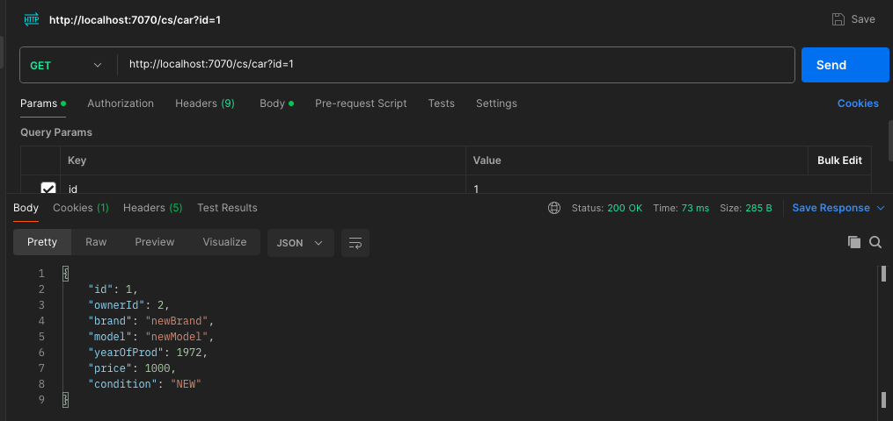

# Сервис для управления автосалоном. Приложение позволяет пользователям управлять базой данных автомобилей, обрабатывать заказы клиентов на покупку и обслуживание автомобилей, а также управлять учетными записями пользователей.

## Welcome!

WEB приложение. Отправка данных через HTTP-запросы

## Используемые технологии:

* Java 17

* Maven

* TomCat

* Liquibase

### 1. Запуск приложения.
Перейдите в корень проекта(блок homework_3) через командную строку и выполните команды:

```
mvn clean install
``` 
Запустите TomCat. Поместите файл homework_3/target/cs.war  в Тomcat  в папку webapps .

Отправляйте запросы, например через PostMan. (номер порта localhost зависит от настроек Вашего TomCat!)
* Зарегистрируйтесь (http://localhost:7070/sign-up):

* Теперь можете войти под своим ID и паролем(http://localhost:7070/sign-in):

Как обычный клиент, вы можете:
* Посмотреть любую машину, введя её ID, (http://localhost:7070/car?id=) + ID:

* Обновить данные по своей машине, введя ID вашей машины и новые данные в форме JSON (http://localhost:7070//update-car):
 
* Удалить свой заказ на машину (http://localhost:7070/delete-order):
 
* Удалить свою машину из БД (http://localhost:7070/delete-car):
    
* Создать заказ на машину(сервис - если машина Ваша, покупка - если машина ещё не Ваша) (http://localhost:7070/create-order):
    
* Создать карточку машины для записи в БД (http://localhost:7070/create-car):
  
* Есть поиск машины по интересующим Вас параметрам (http://localhost:7070/cars-with-parameters?ownerId=X&brand=X&model=X&yearOfProd=X&priceFrom=X&priceTo=X&condition=X) где вместо X впишите интересующие Вас параметры. Или пробел:
  
* Посмотреть список всех доступных машин (http://localhost:7070/all-cars):
  

Следующие запросы доступны только админу или менеджеру
* Посмотреть любой заказ (http://localhost:7070/order?id=) + ID:

* Найти заказы по параметрам (http://localhost:7070/orders-with-parameters?authorId=X&carId=X&type=X&status=X) где вместо X впишите интересующие Вас параметры. Или пробел:

* Закрыть любой заказ (http://localhost:7070/close-order?id=) + ID:

* Посмотреть все заказы (http://localhost:7070/all-orders):


Следующие запросы доступны только админу
* Посмотреть карточку любого пользователя (http://localhost:7070/user?id=) + ID:
  
* Найти группу пользователей по параметрам (http://localhost:7070/users-with-parameters?role=X?name=X&contactInfo=X&buysAmount=X) где вместо X впишите интересующие Вас параметры. Или пробел:
  
* Обновить карточку с данными пользователя (http://localhost:7070/update-user) :
  
* Посмотреть лог действий любого пользователя(выбрать по параметрам) (http://localhost:7070/log-with-parameters?userId=X?action=X&dateTimeFom=X&dateTimeTo=X) где вместо X впишите интересующие Вас параметры. Или пробел:
  
* Удалить карточку пользователя из БД (http://localhost:7070/delete-user?id=) + ID:
  
* Создать карточку пользователя (http://localhost:7070/create-user):
  
* Посмотреть список всех пользователей (http://localhost:7070/all-users):
  


## Have a good job!
